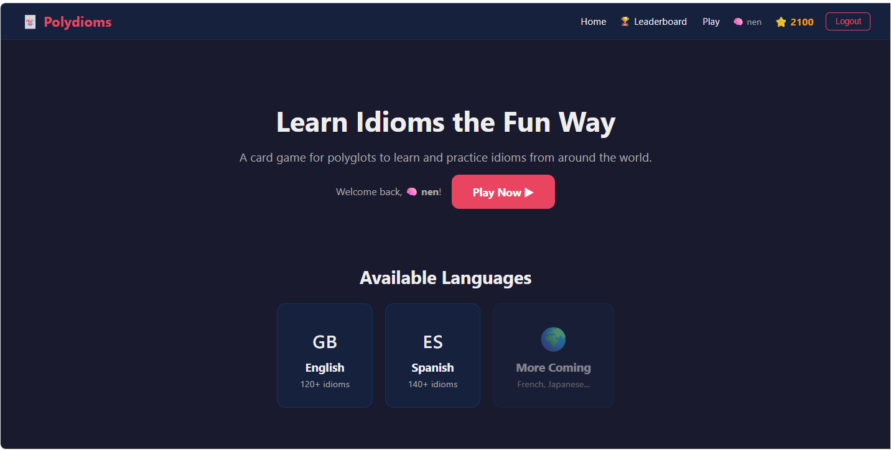
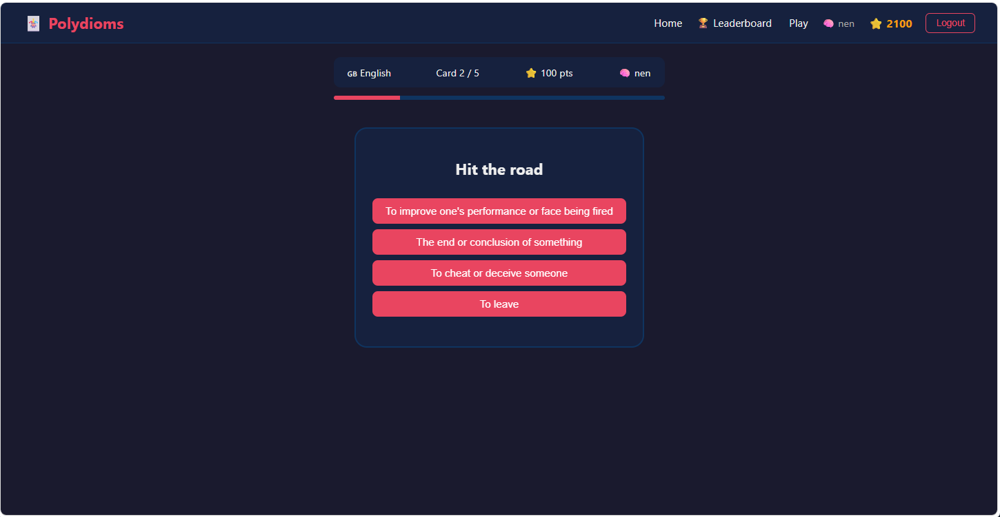
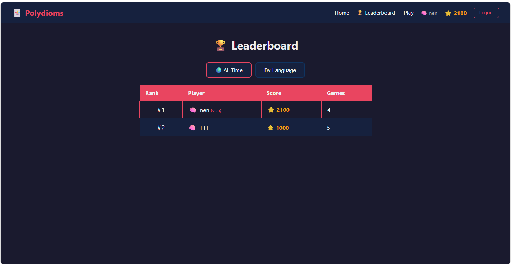

# Polydioms

## Learn Idioms the Fun Way
A card game for polyglots to learn and practice idioms from around the world.

Hi, hello! This is Nenjo, and I’m going to present to you my final project for CS50x. I used JavaScript, HTML, and CSS for this project, React.js for the frontend framework, and Node.js functions for the backend. I used Neon for the database, deployed the API on Netlify, and the frontend is deployed on GitHub Pages.

This project is called Polydioms. It is a flip-card game to help users learn idioms in different languages. Right now, I’ve added idioms in Spanish and English. Users can register, log in, and log out. The app only captures a codename or username, so users can register even without an email, as long as the codename is unique.

Let’s start playing the game. On the game setup screen, the user can select which language they want, either English or Spanish, choose the difficulty level, and select the number of cards to be shown. Once that’s done and the user clicks “Start Game,” the game begins.

The game will show the card progress and display idioms randomly. The user chooses the meaning of each idiom from multiple-choice options, and if the answer is correct, the points are recorded.

Once the game is finished, the user can visit the leaderboard and view the rankings, either overall (all time) or filtered by language.

That’s it! Enjoy, and I’ll share the link below. Thank you, and happy coding!

